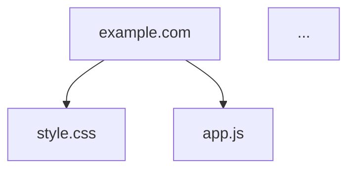

# Web Dependency Analyzer (WDA)
> PowerShell script to analyze and visualize all HTTP/HTTPS dependencies of a web page

[](https://github.com/PowerShell/PowerShell)
[](LICENSE)
[]()

---

## 📋 Description

Web Dependency Analyzer (WDA) is an operational security analysis tool that identifies and maps all external resources loaded by a web page. It helps to:

- **Audit the attack surface** of a web application
- **Identify third-party dependencies** (CDNs, external libraries)
- **Detect insecure resources** (HTTP vs HTTPS)
- **Visualize the architecture** of resource loading
- **Analyze performance** (sizes, loading times)

---

## ✨ Features

### Complete Analysis
- ✅ Extract all HTML resources (scripts, CSS, images, fonts, media)
- ✅ Recursive analysis of CSS and JavaScript dependencies
- ✅ Support for relative, absolute, and protocol-relative URLs (//)
- ✅ Automatic resource type detection
- ✅ HTTP redirect tracking
- ✅ SSL/TLS certificate validation

### Detected Resource Types
- **HTML** - Pages and documents
- **CSS** - Stylesheets
- **JavaScript** - Scripts and libraries
- **Images** - JPG, PNG, GIF, WebP, SVG, etc.
- **Fonts** - WOFF, WOFF2, TTF, EOT, OTF
- **Media** - Videos (MP4, WebM) and audio (MP3, WAV, OGG)
- **AJAX** - JSON and XML endpoints
- **Other** - Various resources

### Export Formats

| Format | Description | Use Case |
|--------|-------------|----------|
| **TXT** | Simple text report | Quick reading, logs |
| **HTML** | Interactive report with charts | Complete visualization |
| **JSON** | Structured export | Integration with other tools |
| **Mermaid** | Flow diagram | Documentation, presentation |
| **GraphViz** | DOT graph | Advanced visualization |

---

## 🚀 Installation

### Prerequisites

- **Windows** with PowerShell 5.1 or higher
- **.NET Framework** 4.5 or higher
- **Internet access** to analyze websites

### Download

```powershell
# Clone or download the script file
Invoke-WebRequest -Uri "https://raw.githubusercontent.com/jbianco-prog/WebDependencyAnalysis/refs/heads/master/WebDependencyAnalysis.ps1" -OutFile "WebDependencyAnalysis.ps1"
```

### Configure Execution Policy

```powershell
# Allow script execution (if needed)
Set-ExecutionPolicy -ExecutionPolicy RemoteSigned -Scope CurrentUser
```

---

## 💻 Usage

### Basic Usage

```powershell
# Simple analysis with interactive interface
.\WebDependencyAnalyzer.ps1

# Analysis with URL parameter
.\WebDependencyAnalyzer.ps1 -TargetURL "https://example.com"
```

### Advanced Usage

```powershell
# Specify output format
.\WebDependencyAnalyzer.ps1 -TargetURL "https://example.com" -OutputFormat "html"

# Customize output folder
.\WebDependencyAnalyzer.ps1 -TargetURL "https://example.com" -OutputFolder "C:\Reports"

# Complete analysis with all formats
.\WebDependencyAnalyzer.ps1 -TargetURL "https://example.com" -OutputFormat "both"
```

### Available Parameters

| Parameter | Type | Default | Description |
|-----------|------|---------|-------------|
| `-TargetURL` | String | (interactive) | URL to analyze |
| `-OutputFormat` | String | "both" | Format: text, html, json, mermaid, graphviz, both |
| `-OutputFolder` | String | ".\WebAnalysis" | Destination folder for reports |

---

## ⚙️ Configuration

### Analysis Options

Modify these variables in the script to customize the analysis:

```powershell
## Recursion depth
$maxDepth = 1                    # 1 = direct dependencies only

## Network behavior
$followRedirects = $true         # Follow HTTP redirects
$timeoutSeconds = 30             # Request timeout (seconds)
$checkSSL = $true                # Check SSL certificates

## User Agent
$userAgent = "Mozilla/5.0..."    # Custom User-Agent string
```

### Filtering Options

```powershell
## Resource inclusion
$includeExternal = $true         # Include external domains
$includeCDN = $true              # Include CDN resources
$includeInline = $true           # Include inline scripts/styles
$includeDataURIs = $false        # Include data: URIs
```

### Display Options

```powershell
## Console display
$showProgress = $true            # Show progress
$colorOutput = $true             # Colored output
$verboseOutput = $false          # Detailed information
```

---

## 📊 Generated Reports

### Text Report (.txt)

Simple and readable report containing:
- General statistics
- List of unique domains
- Resources by type
- Details of each resource (URL, status, size)

### HTML Report (.html)

Interactive report with:
- Visual dashboard with statistics
- Distribution charts
- Sortable and filterable tables
- Loading timeline
- Color coding by resource type

### JSON Export (.json)

Complete data structure:
```json
{
  "targetURL": "https://example.com",
  "analysisDate": "2025-10-27T...",
  "statistics": { ... },
  "resourcesByType": { ... },
  "allResources": { ... }
}
```

### Mermaid Diagram (.mmd)

Dependency visualization as a flowchart:


View at [mermaid.live](https://mermaid.live/)

### GraphViz Diagram (.dot)

Dependency graph for image generation:
```bash
# Generate a PNG image
dot -Tpng WebAnalysis_*.dot -o dependencies.png
```

---

## 📈 Collected Statistics

The script automatically collects:

- **Total number of requests**
- **Successful / failed requests**
- **Total resource size**
- **Number of unique domains**
- **Distribution by resource type**
- **External vs internal domains**
- **HTTPS vs HTTP resources**

---

## 🔒 Security Usage

### Recommended Use Cases

✅ **Security audit** - Identify third-party dependencies  
✅ **OSINT analysis** - Map web infrastructure  
✅ **Compliance testing** - Verify HTTPS usage  
✅ **Optimization** - Identify heavy resources  
✅ **Documentation** - Map architecture  

### Legal Considerations

⚠️ **Important**: Only use this tool on:
- Your own websites
- Sites with explicit authorization
- Public sites within a legal framework (passive OSINT)

❌ **Do not use for**:
- Mass scanning sites without authorization
- Exploiting discovered vulnerabilities
- Bypassing protections

---

## 🛠️ Usage Examples

### Example 1: Quick Analysis

```powershell
# Basic site analysis
.\WebDependencyAnalyzer.ps1 -TargetURL "https://www.example.com"
```

**Result**: TXT + HTML reports in `.\WebAnalysis\`

### Example 2: JSON Export for Integration

```powershell
# JSON export only
.\WebDependencyAnalyzer.ps1 `
    -TargetURL "https://api.example.com" `
    -OutputFormat "json" `
    -OutputFolder "C:\SecurityAudits"
```

**Result**: JSON file for automated processing

### Example 3: Visual Documentation

```powershell
# Generate Mermaid diagram
.\WebDependencyAnalyzer.ps1 `
    -TargetURL "https://myapp.com" `
    -OutputFormat "mermaid"
```

**Result**: .mmd diagram for documentation

### Example 4: Complete Audit

```powershell
# Comprehensive analysis with GraphViz
.\WebDependencyAnalyzer.ps1 `
    -TargetURL "https://corporate-site.com" `
    -OutputFormat "both" `
    -OutputFolder ".\Audit_$(Get-Date -Format 'yyyyMMdd')"

# Generate PNG graph
cd ".\Audit_20251027"
dot -Tpng *.dot -o dependency-graph.png
```

**Result**: Complete audit with graphical visualization

---

## 🔧 Troubleshooting

### Error: "Cannot load HTML content"

**Solution**: The site uses JavaScript to load content
- ✅ Use a headless browser (Selenium, Puppeteer)
- ✅ Analyze network traffic with DevTools

### Error: "Invalid SSL certificate"

**Solution**: Temporarily disable SSL verification
```powershell
$checkSSL = $false
```

### Request Timeout

**Solution**: Increase timeout
```powershell
$timeoutSeconds = 60
```

### Too Many Detected Resources

**Solution**: Limit analysis
```powershell
$maxDepth = 1              # No recursion
$includeExternal = $false  # Ignore external domains
```

---

## 📝 Changelog

### Version 2.0 Augmented by Ai (10/16/2025)
- 🚀 Added Mermaid and GraphViz support
- 📊 Improved interactive HTML report
- 🎨 Better dependency visualization
- ⚡ Performance optimization
- 🔒 Enhanced SSL/TLS handling

### Version 1.0 (10/10/2008)
- 🎉 Initial version
- 📄 TXT and HTML reports
- 🔍 Basic dependency analysis

---

## 👨‍💻 Author

**Micro-one**
- Website: [micro-one.com](https://micro-one.com)
- Email: contact@micro-one.com

---

## 🤝 Contribution

To report a bug or suggest an improvement:
- 📧 Contact contact@micro-one.com
- 🌐 Visit [micro-one.com](https://micro-one.com)

---

## 📚 Additional Resources

### Complementary Tools
- **Burp Suite** - HTTP interception proxy
- **OWASP ZAP** - Vulnerability scanner
- **Wappalyzer** - Web technology detection
- **BuiltWith** - Technical stack analysis

### Documentation
- [OWASP Testing Guide](https://owasp.org/www-project-web-security-testing-guide/)
- [MDN Web Docs](https://developer.mozilla.org/)
- [PowerShell Documentation](https://docs.microsoft.com/powershell/)

---

**⚡ Fast analysis. Clear visualization. Enhanced security.**
