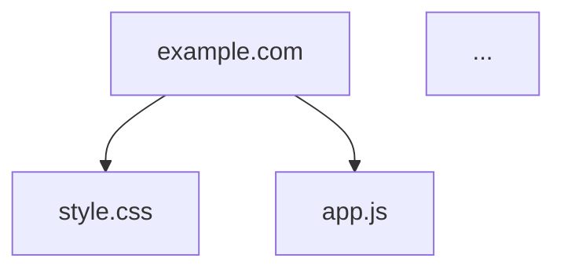

# Web Dependency Analyzer (WDA)
> Script PowerShell pour analyser et visualiser toutes les dépendances HTTP/HTTPS d'une page web

[](https://github.com/PowerShell/PowerShell)
[](LICENSE)
[]()

---

## 📋 Description

Web Dependency Analyzer (WDA) est un outil d'analyse de sécurité opérationnelle qui identifie et cartographie toutes les ressources externes chargées par une page web. Il permet de :

- **Auditer la surface d'attaque** d'une application web
- **Identifier les dépendances tierces** (CDN, bibliothèques externes)
- **Détecter les ressources non sécurisées** (HTTP vs HTTPS)
- **Visualiser l'architecture** de chargement des ressources
- **Analyser les performances** (tailles, temps de chargement)

---

## ✨ Fonctionnalités

### Analyse Complète
- ✅ Extraction de toutes les ressources HTML (scripts, CSS, images, polices, médias)
- ✅ Analyse récursive des dépendances CSS et JavaScript
- ✅ Support des URLs relatives, absolues et protocol-relative (//)
- ✅ Détection automatique du type de ressource
- ✅ Suivi des redirections HTTP
- ✅ Validation des certificats SSL/TLS

### Types de Ressources Détectés
- **HTML** - Pages et documents
- **CSS** - Feuilles de style
- **JavaScript** - Scripts et bibliothèques
- **Images** - JPG, PNG, GIF, WebP, SVG, etc.
- **Polices** - WOFF, WOFF2, TTF, EOT, OTF
- **Médias** - Vidéos (MP4, WebM) et audio (MP3, WAV, OGG)
- **AJAX** - Points de terminaison JSON et XML
- **Autres** - Ressources diverses

### Formats d'Export

| Format | Description | Cas d'usage |
|--------|-------------|-------------|
| **TXT** | Rapport texte simple | Lecture rapide, logs |
| **HTML** | Rapport interactif avec graphiques | Visualisation complète |
| **JSON** | Export structuré | Intégration avec d'autres outils |
| **Mermaid** | Diagramme de flux | Documentation, présentation |
| **GraphViz** | Graphe DOT | Visualisation avancée |

---

## 🚀 Installation

### Prérequis

- **Windows** avec PowerShell 5.1 ou supérieur
- **.NET Framework** 4.5 ou supérieur
- **Accès Internet** pour analyser les sites web

### Téléchargement

```powershell
# Cloner ou télécharger le script
# Placer le fichier dans un répertoire de votre choix
```

### Configuration de la Politique d'Exécution

```powershell
# Autoriser l'exécution de scripts (si nécessaire)
Set-ExecutionPolicy -ExecutionPolicy RemoteSigned -Scope CurrentUser
```

---

## 💻 Utilisation

### Utilisation Basique

```powershell
# Analyse simple avec interface interactive
.\WebDependencyAnalyzer.ps1

# Analyse avec URL en paramètre
.\WebDependencyAnalyzer.ps1 -TargetURL "https://example.com"
```

### Utilisation Avancée

```powershell
# Spécifier le format de sortie
.\WebDependencyAnalyzer.ps1 -TargetURL "https://example.com" -OutputFormat "html"

# Personnaliser le dossier de sortie
.\WebDependencyAnalyzer.ps1 -TargetURL "https://example.com" -OutputFolder "C:\Rapports"

# Analyse complète avec tous les formats
.\WebDependencyAnalyzer.ps1 -TargetURL "https://example.com" -OutputFormat "both"
```

### Paramètres Disponibles

| Paramètre | Type | Par défaut | Description |
|-----------|------|------------|-------------|
| `-TargetURL` | String | (interactif) | URL à analyser |
| `-OutputFormat` | String | "both" | Format : text, html, json, mermaid, graphviz, both |
| `-OutputFolder` | String | ".\WebAnalysis" | Dossier de destination des rapports |

---

## ⚙️ Configuration

### Options d'Analyse

Modifiez ces variables dans le script pour personnaliser l'analyse :

```powershell
## Profondeur de récursion
$maxDepth = 1                    # 1 = dépendances directes uniquement

## Comportement réseau
$followRedirects = $true         # Suivre les redirections HTTP
$timeoutSeconds = 30             # Timeout des requêtes (secondes)
$checkSSL = $true                # Vérifier les certificats SSL

## User Agent
$userAgent = "Mozilla/5.0..."    # Chaîne User-Agent personnalisée
```

### Options de Filtrage

```powershell
## Inclusion de ressources
$includeExternal = $true         # Inclure les domaines externes
$includeCDN = $true              # Inclure les ressources CDN
$includeInline = $true           # Inclure les scripts/styles inline
$includeDataURIs = $false        # Inclure les data: URIs
```

### Options d'Affichage

```powershell
## Affichage console
$showProgress = $true            # Afficher la progression
$colorOutput = $true             # Sortie colorée
$verboseOutput = $false          # Informations détaillées
```

---

## 📊 Rapports Générés

### Rapport Texte (.txt)

Rapport simple et lisible contenant :
- Statistiques générales
- Liste des domaines uniques
- Ressources par type
- Détails de chaque ressource (URL, statut, taille)

### Rapport HTML (.html)

Rapport interactif avec :
- Tableau de bord visuel avec statistiques
- Graphiques de distribution
- Tableaux triables et filtrables
- Chronologie de chargement
- Code couleur par type de ressource

### Export JSON (.json)

Structure de données complète :
```json
{
  "targetURL": "https://example.com",
  "analysisDate": "2025-10-27T...",
  "statistics": { ... },
  "resourcesByType": { ... },
  "allResources": { ... }
}
```

### Diagramme Mermaid (.mmd)

Visualisation des dépendances sous forme de flowchart :


Visualisez sur [mermaid.live](https://mermaid.live/)

### Diagramme GraphViz (.dot)

Graphe de dépendances pour génération d'images :
```bash
# Générer une image PNG
dot -Tpng WebAnalysis_*.dot -o dependencies.png
```

---

## 📈 Statistiques Collectées

Le script collecte automatiquement :

- **Nombre total de requêtes**
- **Requêtes réussies / échouées**
- **Taille totale des ressources**
- **Nombre de domaines uniques**
- **Répartition par type de ressource**
- **Domaines externes vs internes**
- **Ressources HTTPS vs HTTP**

---

## 🔒 Utilisation en Sécurité

### Cas d'Usage Recommandés

✅ **Audit de sécurité** - Identifier les dépendances tierces  
✅ **Analyse OSINT** - Cartographier l'infrastructure web  
✅ **Test de conformité** - Vérifier l'utilisation de HTTPS  
✅ **Optimisation** - Identifier les ressources lourdes  
✅ **Documentation** - Cartographier l'architecture  

### Considérations Légales

⚠️ **Important** : N'utilisez cet outil que sur :
- Vos propres sites web
- Sites avec autorisation explicite
- Sites publics dans un cadre légal (OSINT passive)

❌ **Ne pas utiliser pour** :
- Scanner massivement des sites sans autorisation
- Exploiter des vulnérabilités découvertes
- Contourner des protections

---

## 🛠️ Exemples d'Utilisation

### Exemple 1 : Analyse Rapide

```powershell
# Analyse basique d'un site
.\WebDependencyAnalyzer.ps1 -TargetURL "https://www.example.com"
```

**Résultat** : Rapports TXT + HTML dans `.\WebAnalysis\`

### Exemple 2 : Export JSON pour Intégration

```powershell
# Export JSON uniquement
.\WebDependencyAnalyzer.ps1 `
    -TargetURL "https://api.example.com" `
    -OutputFormat "json" `
    -OutputFolder "C:\AuditsSécurité"
```

**Résultat** : Fichier JSON pour traitement automatisé

### Exemple 3 : Documentation Visuelle

```powershell
# Génération de diagramme Mermaid
.\WebDependencyAnalyzer.ps1 `
    -TargetURL "https://monapp.com" `
    -OutputFormat "mermaid"
```

**Résultat** : Diagramme .mmd pour documentation

### Exemple 4 : Audit Complet

```powershell
# Analyse exhaustive avec GraphViz
.\WebDependencyAnalyzer.ps1 `
    -TargetURL "https://site-entreprise.com" `
    -OutputFormat "both" `
    -OutputFolder ".\Audit_$(Get-Date -Format 'yyyyMMdd')"

# Générer le graphe PNG
cd ".\Audit_20251027"
dot -Tpng *.dot -o graphe-dependances.png
```

**Résultat** : Audit complet avec visualisation graphique

---

## 🔧 Dépannage

### Erreur : "Impossible de charger le contenu HTML"

**Solution** : Le site utilise JavaScript pour charger le contenu
- ✅ Utilisez un navigateur headless (Selenium, Puppeteer)
- ✅ Analysez le trafic réseau avec les DevTools

### Erreur : "Certificat SSL invalide"

**Solution** : Désactivez temporairement la vérification SSL
```powershell
$checkSSL = $false
```

### Timeout des Requêtes

**Solution** : Augmentez le timeout
```powershell
$timeoutSeconds = 60
```

### Trop de Ressources Détectées

**Solution** : Limitez l'analyse
```powershell
$maxDepth = 1              # Pas de récursion
$includeExternal = $false  # Ignorer les domaines externes
```

---

## 📝 Historique des Versions

### Version 2.0 Augmenté par IA (16/10/2025)
- 🚀 Ajout support Mermaid et GraphViz
- 📊 Rapport HTML interactif amélioré
- 🎨 Meilleure visualisation des dépendances
- ⚡ Optimisation des performances
- 🔒 Amélioration de la gestion SSL/TLS

### Version 1.0 (10/10/2008)
- 🎉 Version initiale
- 📄 Rapports TXT et HTML
- 🔍 Analyse de base des dépendances

---

## 👨‍💻 Auteur

**Micro-one**
- Site web : [micro-one.com](https://micro-one.com)
- Email : contact@micro-one.com

---

## 🤝 Contribution

Pour signaler un bug ou suggérer une amélioration :
- 📧 Contactez contact@micro-one.com
- 🌐 Visitez [micro-one.com](https://micro-one.com)

---

## 📚 Ressources Supplémentaires

### Outils Complémentaires
- **Burp Suite** - Proxy d'interception HTTP
- **OWASP ZAP** - Scanner de vulnérabilités
- **Wappalyzer** - Détection de technologies web
- **BuiltWith** - Analyse de stack technique

### Documentation
- [Guide de Test OWASP](https://owasp.org/www-project-web-security-testing-guide/)
- [MDN Web Docs](https://developer.mozilla.org/)
- [Documentation PowerShell](https://docs.microsoft.com/powershell/)

---

**⚡ Analyse rapide. Visualisation claire. Sécurité renforcée.**
